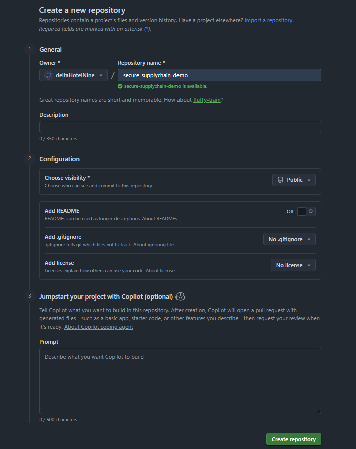
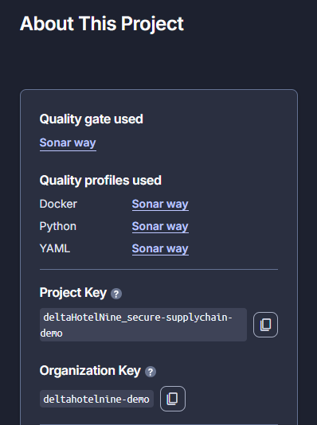
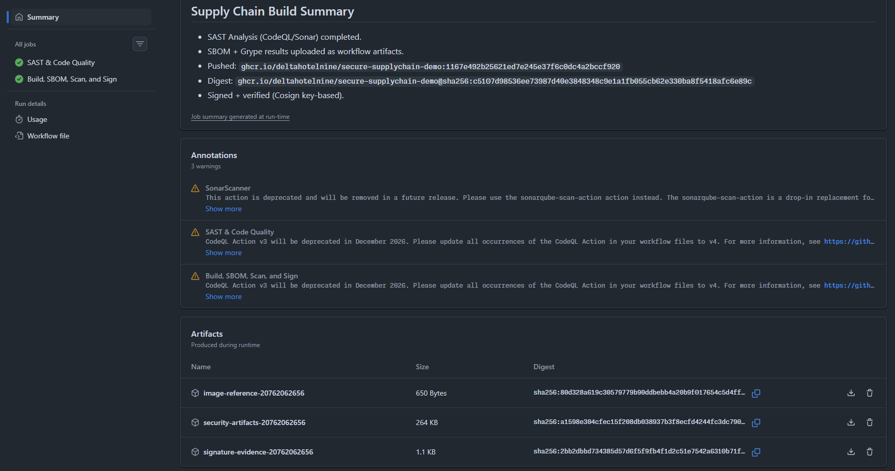
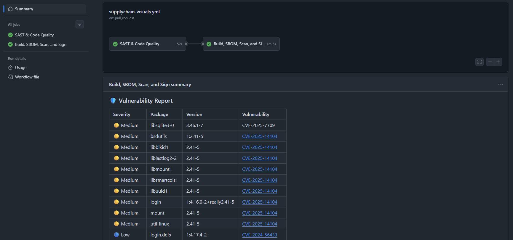
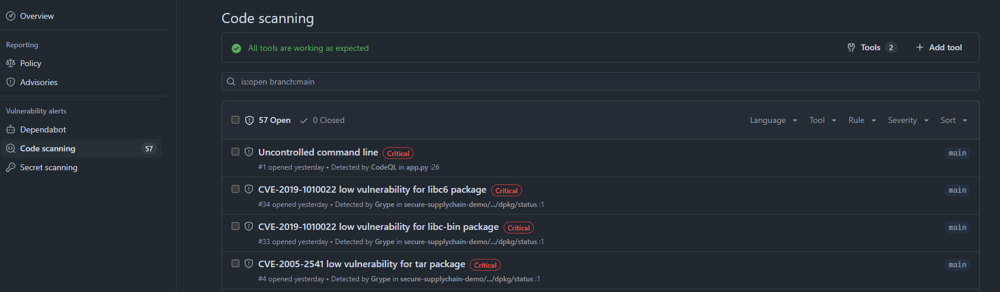
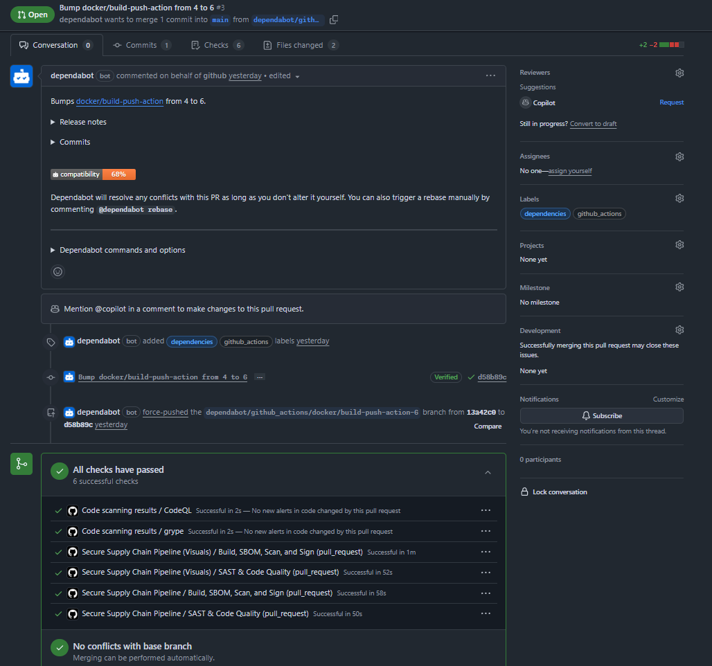

# Secure Software Supply Chain Demonstration Walkthrough

This walkthrough builds a small containerized application with **intentional vulnerabilities**, generates an SBOM, scans for vulnerabilities (Container & Code), signs the image, stores evidence, and then enforces admission policies locally in Kubernetes.

**The Chain:** Code -> SAST (CodeQL + SonarCloud) -> Build -> SBOM (Syft) -> Scan (Grype) -> Sign (Cosign) -> Enforce (Kyverno).

- **Policy #1:** Prevent the deployment of images using the `:latest` tag
- **Policy #2:** Require images to be signed and verified leveraging Cosign

Why this demonstration matters in DoD terms (high level):

- **SAST (Code Scanning):** Identifies vulnerabilities *before* the artifact is built (Shift Left).
- **SBOM:** Transparency of software components (EO 14028 & NIST SBOM Workstreams).
- **Vuln scanning:** Continuous risk identification (NIST 800-53 Rev. 5 RA/SI/SA Families).
- **Signing + admission enforcement:** Provenance and "only trusted artifacts run" (Zero Trust).

> [!NOTE]
> This is a **training/demonstration** pattern. In a real enterprise, approved enterprise repos and registries with hardened hosting and identity would be used.

---

## Overview of Walkthrough

1. Prepare workstation for usage
2. Create repo and local application (with purposeful bugs for SAST detection)
3. Containerize the application
4. Create Cosign keypair
5. Enable SAST (SonarCloud & CodeQL)
6. Build GitHub Actions pipeline:
    - CodeQL & SonarCloud analysis
    - Build container
    - Generate SBOM (Syft) with Table Output
    - Vulnerability Scan (Grype) with Table Output
    - Push to GHCR & Sign with Cosign
7. Establish local Kubernetes cluster (Kind) & Policy Engine (Kyverno)
8. Create and apply admission policies
9. Reviewing Results (SAST & Pipeline)
10. Get signed image for testing
11. Demonstrate failing deployments
12. Demonstrate passing deployments

---

## Table of Contents

- [0. Prerequisites (Accounts and Tools)](#0-prerequisites-accounts-and-tools)
- [1. Create GitHub repository and clone local](#1-create-github-repository-and-clone-local)
- [2. Create a sample web application (Flask)](#2-create-a-sample-web-application-flask)
- [3. Containerize and verify locally](#3-containerize-and-verify-locally)
- [4. Use Cosign to generate a keypair](#4-use-cosign-to-generate-a-keypair)
- [5. Configure Security Scanners (SAST & Secret Scanning)](#5-configure-security-scanners-sast--secret-scanning)
- [6. Establish GitHub Actions pipeline](#6-establish-github-actions-pipeline)
- [7. Establish local Kubernetes cluster (Kind)](#7-establish-local-kubernetes-cluster-kind)
- [8. Install Kyverno](#8-install-kyverno)
- [9. Load Cosign public key](#9-load-cosign-public-key)
- [10. Create Kyverno policies](#10-create-kyverno-policies)
- [11. Security Findings (SAST & Vulnerability Analysis)](#11-security-findings-sast--vulnerability-analysis)
- [12. Get signed image for testing](#12-get-signed-image-for-testing)
- [13. Demonstrate policy Failures and Successes](#13-demonstrate-policy-failures-and-successes)
- [14. Evidence storage (Artifacts)](#14-evidence-storage-artifacts)
- [15. Clean Up Resources](#15-clean-up-resources)

---

## 0. Prerequisites (Accounts and Tools)

*Objective: Prepare the environment with the specific accounts and tools required to build the secure supply chain.*

We start this demonstration by establishing the necessary accounts (GitHub & SonarCloud) and prepare our system with the tools we will be leveraging throughout this demonstration.

### 0.1 Accounts

For this demonstration you will need:

- **GitHub Account**
- **SonarCloud Account:** Go to [sonarcloud.io](https://sonarcloud.io) and sign up/login using your GitHub account.

### 0.2 Install Tooling

**Windows (PowerShell) - recommended via `winget`**

> [!TIP]
> If you do not have `winget` available on your system, install/enable Windows Package Manager via [winget installation steps](https://learn.microsoft.com/en-us/windows/package-manager/winget/) and restart your terminal.

Run PowerShell as your normal user, Admin is not required for most of the below installations:

```powershell
winget install --id Git.Git -e
winget install --id Python.Python.3.13 -e
winget install --id Microsoft.VisualStudioCode
winget install --id Docker.DockerDesktop -e
winget install --id Kubernetes.kubectl -e
winget install --id Kubernetes.kind
winget install --id Helm.Helm -e
winget install --id Sigstore.Cosign -e
winget install --id Anchore.Syft -e
winget install --id Anchore.Grype -e
winget install --id GitHub.cli -e
```

**MacOS (Terminal) - recommended via `brew`**

> [!TIP]
> If you do not have `brew` available on your system, install/enable Homebrew Package Manager via [Homebrew](brew.sh) steps and restart your terminal.

```bash
brew install git
brew install --cask visual-studio-code
brew install python@3.13
brew install --cask docker
brew install kubectl
brew install helm
brew install cosign
brew install syft
brew install grype
brew install kind
brew install gh
```

### 0.3 Tool Verification

1. On your system, start Docker Desktop and complete any required setup or account authentication via your GitHub account. Leave Docker Desktop running in the background for the remainder of this demonstration.
2. Verify tools were installed successfully by running the following commands. Each command should return an associated version. If you recieve any `command not found` errors, attempt installation again.

```powershell
git --version
code --version
python3 --version
docker version
kubectl version --client --output=yaml
helm version
kind version
cosign version
syft version
grype version
gh --version
```

### 0.4 Authenticate with GitHub CLI

To push code to your repository securely, we will authenticate using the GitHub CLI. This handles credential management automatically.

Run the following command and follow the interactive prompts:

```powershell
gh auth login
```

**Recommended choices:**
1.  **What account do you want to log into?** -> `GitHub.com`
2.  **What is your preferred protocol for Git operations?** -> `HTTPS`
3.  **Authenticate Git with your GitHub credentials?** -> `Y`
4.  **How would you like to authenticate GitHub CLI?** -> `Login with a web browser`

Copy the one-time code provided, press `Enter` to open your browser, and paste the code to authorize.

### 0.5 Configure Git Identity

Ensure your commits are attributed correctly by setting your git username and email.

```powershell
git config --global user.name "Your Name"
git config --global user.email "your-email@example.com"
```

## 1. Create GitHub repository and clone local

*Objective: Initialize the version control system that will host our code and automation pipeline.*

GitHub will act as our version control system and CI workflow automation via GitHub Actions.

### 1.1 Create the repo via GitHub UI

1. Go to GitHub.com and sign in.
2. Click green `New` repository icon.
3. Name: `secure-supplychain-demo` (lowercase).
4. Visibility: **Public**.
5. The following options can remain in their default state:
    - `Add a README` - Off
    - `Add .gitignore` - No .gitignore
    - `Add license` - No license
6. Create Repository.



### 1.2 Clone repo locally

Replace <YOUR_GITHUB_USERNAME> in all below steps with your GitHub account name.

**Windows**

```powershell
cd ~ 
git clone https://github.com/<YOUR_GITHUB_USERNAME>/secure-supplychain-demo.git
cd .\secure-supplychain-demo
```

**MacOS**

```bash
cd ~ 
git clone https://github.com/<YOUR_GITHUB_USERNAME>/secure-supplychain-demo.git
cd secure-supplychain-demo
```

**_Verification:_**

```powershell
git remote -v
```

**_Expected Result:_**  
 `origin https://github.com/YOUR_GITHUB_USERNAME>/secure-supplychain-demo (fetch)`  
 `origin https://github.com/YOUR_GITHUB_USERNAME>/secure-supplychain-demo (push)`  

## 2. Create a sample web application (Flask)

*Objective: Develop a "workload" with intentional vulnerabilities (Secrets & RCE) to demonstrate detection capabilities.*

We will create an application with **intentional vulnerabilities** to simulate out "workload". This code will be scanned showcasing our SAST capability. Further, the application will be built into an image enabling us to showcase the secure supply chain activities.

### 2.1 Create app files

Start by opening Visual Studio Code on your system. Then in the top left click `File` -> `Open Folder` and path to your `secure-supplychain-demo` folder that was created in the previous steps. To create any files in the following steps, right click within the `Exporer` section of Visual Studio Code and select `New File...`.

#### Create `app.py`

This code contains a **Hardcoded Secret** and a **Command Injection** vulnerability for demonstration purposes.

```python
import subprocess
from flask import Flask, request

app = Flask(__name__)

# Vulnerability #1: Hardcoded Secret (CWE-798)
# SAST tools should flag this as a credential exposure
API_KEY = "12345-SUPER-SECRET-KEY-DO-NOT-COMMIT"

@app.route("/")
def home():
    return "Welcome to the Secure Supply Chain Demo!"


@app.route("/status")
def status():
    return {"status": "All systems operational"}


# Vulnerability #2: Remote Command Execution (RCE) / Command Injection (CWE-78)
# SAST tools should flag the use of 'shell=True' with user input
@app.route("/debug")
def debug():
    cmd = request.args.get("cmd", "whoami")
    # This is intentionally vulnerable code for demonstration purposes
    return subprocess.check_output(cmd, shell=True)


if __name__ == "__main__":
    app.run(host="0.0.0.0", port=8080)
```

#### Create `requirements.txt`

```text
flask==3.0.3
```

**_Verification:_**
Ensure your project folder structure matches the below:

```text
secure-supplychain-demo/
├── app.py
└── requirements.txt
```

### 2.2 Run locally and test

In your existing terminal window, within the project directory complete the following:

**Windows**

```powershell
python3 -m venv .venv
.\.venv\Scripts\Activate.ps1
python3 -m pip install --upgrade pip
pip install -r requirements.txt
python .\app.py
```

**MacOS**

```bash
python3 -m venv .venv
source .venv/bin/activate
python3 -m pip install --upgrade pip
pip install -r requirements.txt
python3 app.py
```

**_Verification via a new terminal:_**

Windows Terminal:

```powershell
Invoke-WebRequest http://localhost:8080 | Select-Object -ExpandProperty Content
Invoke-WebRequest http://localhost:8080/status | Select-Object -ExpandProperty Content
```

MacOS Terminal:

```bash
curl -s http://localhost:8080
curl -s http://localhost:8080/status
```

_**Expected Output:**_

- `Welcome to the Secure Supply Chain Demo!`
- JSON health response `status: All systems operational`

Stop the server with `Ctrl+C` and close the **_new_** terminal that was used to verify. Input the below command to end the python virtual environment.

```bash
deactivate
```

## 3. Containerize and verify locally

*Objective: Package the application into a container image and verify it runs locally before automation.*

We will now create the container image that will be used to showcase the activities within the secure supply chain.

### 3.1 Create a Dockerfile

#### Get base digest

```powershell
docker pull python:3.13-slim
docker image inspect python:3.13-slim --format "{{index .RepoDigests 0}}"
```

Expected Output: `python@sha256:...`

Copy the output string and use it within the Dockerfile in the following step.

#### Create Dockerfile with base digest

Create `Dockerfile` (replace `<PASTE_DIGEST>` with the output from above, e.g., `python@sha256:...`).

```dockerfile
FROM <PASTE_COPIED_DIGEST_HERE>

ENV PYTHONDONTWRITEBYTECODE=1
ENV PYTHONUNBUFFERED=1

WORKDIR /app

COPY requirements.txt .
RUN pip install --no-cache-dir -r requirements.txt

COPY app.py .

EXPOSE 8080

CMD ["python", "app.py"]
```

### 3.2 Build and test container

In your existing terminal sessions:

#### Build and run image

```powershell
docker build -t demoapp:local .
docker run --rm -p 8080:8080 demoapp:local
```

**_Verification:_**

- In a browser, input URL `http://localhost:8080`  
- In a new terminal, run the `Invoke-WebRequest` or `curl` commands from section 2.2.

**_Expected Output:_**

- In the browser, you should see the `Hello...` string.
- In the terminal, you should get the string returned.

Stop the server with `Ctrl+C` and close the **_new_** terminal that was used to verify.

## 4. Use Cosign to generate a keypair

We will use Cosign to create a keypair that will be used to sign and verify the image. The keypair will be enforced later via Kyverno at admission time. For this demonstration, we are using a locally-generated keypair, however in production, keyless signing via OIDC would be a more secure method.

### 4.1 Generate Keypair

Choose a password you can remember for this demonstration and run the below commands within your existing terminal session that is within your project directory.

**Windows**

```powershell
$env:COSIGN_PASSWORD = Read-Host -AsSecureString | ForEach-Object { [Runtime.InteropServices.Marshal]::PtrToStringAuto([Runtime.InteropServices.Marshal]::SecureStringToBSTR($_)) }

# The terminal will move to a new line and await your input for the password

cosign generate-key-pair
```

**MacOS**

```bash
export COSIGN_PASSWORD='input-a-password-of-your-choosing'
cosign generate-key-pair
```

**_Expected Output:_**

`Private key written to cosign.key`  
`Private key written to cosign.pub`

These new files should be visible within your Visual Studio Code session.

### 4.2 Add secrets to GitHub repo

Go to Repo `Settings` tab -> `Secrets and variables` dropdown -> `Actions` -> `New repository secret`:

Create the following secrets:

- `Name *` = **`COSIGN_PRIVATE_KEY`**; `Secret *` = contents of `cosign.key` file
- `Name *` = **`COSIGN_PUBLIC_KEY`**; `Secret *` = contents of `cosign.pub` file
- `Name *` = **`COSIGN_PASSWORD`**; `Secret *` = the password you used when creating the keypair

> [!WARNING]
> In production, an alternative method like a key vault would be used to store these keys securely

## 5. Configure Security Scanners (SAST & Secret Scanning)

We will now prepare our external scanner and verify repo security settings. CodeQL is built-in to GitHub, but SonarCloud requires setup.

### 5.1 SonarCloud Setup

1. Go to [SonarCloud.io](https://sonarcloud.io) and log in with GitHub.
2. Click the `+` icon (top right) -> **Analyze new project**.
3. Click **Import an organization from GitHub** and select your account in the redirected tab.
4. Click **Only select repositories** and select your **secure-supplychain-demo** repo from the dropdown.
5. Click **Install & Authorize**.
6. When prompted, input a `Name` and unique `Key` to reference this account and repo within SonarCloud. 
7. Under `Organization Plan` select **Free** tier for the purposes of this demonstration.
8. Click **Create Organization**.
9. Click **Analyze a new project** and select the `secure-supplychain-demo` repo.
10. Click **Set Up**.
11. Click **Previous version** followed by clicking **Create Project**.
12. Choose **With GitHub Actions**.
13. **SonarCloud will provide a token (SONAR_TOKEN).** Copy this string.
14. Go to your GitHub Repo -> `Settings` -> `Secrets and variables` -> `Actions` -> `New repository secret`.
    - Name: `SONAR_TOKEN`
    - Value: `<PASTE_TOKEN_FROM_SONARCLOUD>`
    - Click **Add secret**.
15. For other languages, you can follow the langauge specific scanning steps. For Python, we will use the action that will scan the code natively.



### 5.2 Create SonarCloud Properties File

1. In SonarCloud, click on **My Projects** at the top, followed by your **secure-suppplychain-demo** project listed.
2. In the bottom left, click on **Information** and note the `Project Key` and `Organization Key` values.
3. In VS Code, create a file named `sonar-project.properties` in the root of your repository (where `app.py` is).
4. Add the following content, replacing the placeholders with the values you saw in the SonarCloud setup screen:

File - `sonar-project.properties`:

```properties
    sonar.organization=<YOUR_ORG_KEY>
    sonar.projectKey=<YOUR_PROJECT_KEY>
    sonar.python.version=3.13
```

5. Save the file.

### 5.3 Enable Secret Scanning & Push Protection

1. In your GitHub Repository, click `Settings` -> `Advanced Security` (left menu).
2. Scroll to **Secret scanning**.
3. Ensure **Secret scanning** is "Active" by seeing the button to "Disable".
4. Ensure **Push protection** is "Active" by seeing the button to "Disable".

> [!NOTE]
> For public repositories, these features are often enabled by default. We enable Push Protection to demonstrate how it guards against the accidental commit of the hardcoded key in our app. For our demonstration, we are not using an example that should be caught.

### 5.4 Verify Code Scanning (CodeQL) Configuration

1. Stay in `Settings` -> `Advanced Security`.
2. Scroll to **Code scanning**.
3. You may see a "Set up" button. **Do not click it yet.**
4. We will be defining the CodeQL configuration *as code* within our workflow file in the next section.
5. Once we push the workflow in Section 6, this section will automatically detect the CodeQL analysis job.

## 6. Establish GitHub Actions pipeline

We will now create our automation workflow that will simulate the modern DevSecOp activities of the secure supply chain:

- consistently produce artifacts
- automatically generate security evidence
- reduce chance of human error

### 6.1 Create workflow files

In VS Code, create the following 3x files:

**File #1** - `.github/workflows/supplychain.yml`:
```yaml
name: Secure Supply Chain Pipeline

on:
    push:
        branches: ["main"]
    pull_request:
        branches: ["main"]
    workflow_dispatch: {}

permissions:
    contents: read
    packages: write
    security-events: write

env:
    REGISTRY: ghcr.io
    IMAGE_TAG: ${{ github.sha }}

jobs:
    sast-analysis:
        name: SAST & Code Quality
        runs-on: ubuntu-latest
        steps:
            - name: Checkout code
              uses: actions/checkout@v4

            - name: Initialize CodeQL
              uses: github/codeql-action/init@v3
              with:
                languages: python

            - name: Perform CodeQL Analysis
              uses: github/codeql-action/analyze@v3

            - name: SonarCloud Scan
              if: ${{ env.SONAR_TOKEN != '' }}
              uses: SonarSource/sonarcloud-github-action@master
              env:
                GITHUB_TOKEN: ${{ secrets.GITHUB_TOKEN }}
                SONAR_TOKEN: ${{ secrets.SONAR_TOKEN }}

    build-sbom-scan-sign:
        name: Build, SBOM, Scan, and Sign
        needs: [sast-analysis]
        runs-on: ubuntu-latest

        steps:
            - name: Checkout code
              uses: actions/checkout@v4

            - name: Compute image refs (lowercase for GHCR)
              id: computerefs
              shell: bash
              run: |
                  set -euo pipefail
                  IMAGE_NAME="$(echo "${GITHUB_REPOSITORY}" | tr '[:upper:]' '[:lower:]')"
                  IMAGE_LOCAL_REF="${IMAGE_NAME}:${IMAGE_TAG}"
                  IMAGE_REF="${REGISTRY}/${IMAGE_NAME}:${IMAGE_TAG}"
                  echo "IMAGE_NAME=${IMAGE_NAME}" >> "${GITHUB_ENV}"
                  echo "IMAGE_LOCAL_REF=${IMAGE_LOCAL_REF}" >> "${GITHUB_ENV}"
                  echo "IMAGE_REF=${IMAGE_REF}" >> "${GITHUB_ENV}"

                  echo "IMAGE_REF=${IMAGE_REF}" >> "${GITHUB_OUTPUT}"

                  echo "IMAGE_NAME=${IMAGE_NAME}"
                  echo "IMAGE_LOCAL_REF=${IMAGE_LOCAL_REF}"
                  echo "IMAGE_REF=${IMAGE_REF}"

            - name: Build image (local)
              shell: bash
              run: |
                  set -euo pipefail
                  docker build -t "${IMAGE_LOCAL_REF}" .

            - name: Log in to GHCR
              if: github.event_name == 'push'
              uses: docker/login-action@v3
              with:
                  registry: ${{ env.REGISTRY }}
                  username: ${{ github.actor }}
                  password: ${{ secrets.GITHUB_TOKEN }}

            - name: Tag image for GHCR
              if: github.event_name == 'push'
              shell: bash
              run: |
                  set -euo pipefail
                  docker tag "${IMAGE_LOCAL_REF}" "${IMAGE_REF}"

            - name: Install Syft and Grype
              shell: bash
              run: |
                  set -euo pipefail
                  curl -sSfL https://raw.githubusercontent.com/anchore/syft/main/install.sh  | sh -s -- -b /usr/local/bin
                  curl -sSfL https://raw.githubusercontent.com/anchore/grype/main/install.sh | sh -s -- -b /usr/local/bin
                  syft version
                  grype version

            - name: Generate SBOM (CycloneDX JSON + Table)
              shell: bash
              run: |
                  set -euo pipefail
                  # Output table to console
                  syft packages "${IMAGE_LOCAL_REF}" -o table
                  # Generate artifact
                  syft packages "${IMAGE_LOCAL_REF}" -o cyclonedx-json > sbom.cdx.json

            - name: Scan for vulnerabilities (Grype JSON + Table + SARIF)
              shell: bash
              run: |
                  set -euo pipefail
                  # Output table to console
                  grype "${IMAGE_LOCAL_REF}" -o table
                  # Generate artifact
                  grype "${IMAGE_LOCAL_REF}" -o json > grype-results.json
                  # Generate SARIF for Security Tab
                  grype "${IMAGE_LOCAL_REF}" -o sarif > grype-results.sarif

            - name: Upload SBOM and scan results (artifact)
              uses: actions/upload-artifact@v4
              with:
                  name: security-artifacts-${{ github.run_id }}
                  path: |
                      sbom.cdx.json
                      grype-results.json
                      grype-results.sarif

            - name: Generate Visual Summary
              shell: bash
              run: |
                # Use Python to parse JSON and output Markdown
                python3 -c '
                import json
                import os

                try:
                    with open("grype-results.json", "r") as f:
                        data = json.load(f)
                except FileNotFoundError:
                    print("Grype results not found.")
                    exit(0)

                print("### 🛡️ Vulnerability Report")
                print("| Severity | Package | Version | Vulnerability |")
                print("| :--- | :--- | :--- | :--- |")

                # Map severity to emoji
                severity_emoji = {
                    "Critical": "🔴",
                    "High": "🟠", 
                    "Medium": "🟡",
                    "Low": "🔵",
                    "Negligible": "⚪",
                    "Unknown": "❔"
                }

                # Sort by severity (Critical first)
                order = ["Critical", "High", "Medium", "Low", "Negligible", "Unknown"]
                matches = data.get("matches", [])
                
                # Simple sorter
                matches.sort(key=lambda x: order.index(x["vulnerability"]["severity"]) if x["vulnerability"]["severity"] in order else 99)

                for m in matches:
                    sev = m["vulnerability"]["severity"]
                    emoji = severity_emoji.get(sev, "❔")
                    pkg = m["artifact"]["name"]
                    ver = m["artifact"]["version"]
                    vuln = m["vulnerability"]["id"]
                    print(f"| {emoji} {sev} | {pkg} | {ver} | {vuln} |")
                
                ' >> $GITHUB_STEP_SUMMARY

            - name: Upload Scan Results (SARIF)
              uses: github/codeql-action/upload-sarif@v3
              with:
                sarif_file: grype-results.sarif
                category: container-scanning

            - name: Push image to GHCR and capture digest
              id: pushimage
              if: github.event_name == 'push'
              uses: docker/build-push-action@v4
              with:
                  push: true
                  tags: ${{ steps.computerefs.outputs.IMAGE_REF }}
              
            - name: Capture image digest
              if: github.event_name == 'push'
              shell: bash
              run: |
                  set -euo pipefail
                  DIGEST="${{ steps.pushimage.outputs.digest }}"
                  if [ -z "${DIGEST}" ]; then
                    echo "ERROR: build-push-action did not return a digest!"
                    exit 1
                  fi
                  echo "Captured image digest: ${DIGEST}"
                  IMAGE_REF_DIGEST="${REGISTRY}/${IMAGE_NAME}@${DIGEST}"

                  echo "IMAGE_REF_DIGEST=${IMAGE_REF_DIGEST}" >> "${GITHUB_ENV}"

                  echo "${IMAGE_REF}"        > image-ref-tag.txt
                  echo "${IMAGE_REF_DIGEST}" > image-ref-digest.txt
                  echo "${DIGEST}"           > image-digest.txt

            - name: Upload image reference (artifact)
              if: github.event_name == 'push'
              uses: actions/upload-artifact@v4
              with:
                  name: image-reference-${{ github.run_id }}
                  path: |
                      image-ref-tag.txt
                      image-ref-digest.txt
                      image-digest.txt

            - name: Install Cosign
              if: github.event_name == 'push'
              uses: sigstore/cosign-installer@v3

            - name: Write Cosign private key
              if: github.event_name == 'push'
              shell: bash
              run: |
                  set -euo pipefail
                  printf '%s' "${{ secrets.COSIGN_PRIVATE_KEY }}" > cosign.key
                  chmod 600 cosign.key

            - name: Sign image by digest (Cosign)
              if: github.event_name == 'push'
              env:
                  COSIGN_PASSWORD: ${{ secrets.COSIGN_PASSWORD }}
              shell: bash
              run: |
                  set -euo pipefail
                  printf 'y' | cosign sign --key cosign.key "${IMAGE_REF_DIGEST}"

            - name: Verify signature (record evidence)
              if: github.event_name == 'push'
              shell: bash
              run: |
                  set -euo pipefail
                  cosign verify --key cosign.pub "${IMAGE_REF_DIGEST}" > cosign-verify.json

            - name: Upload signature verification (artifact)
              if: github.event_name == 'push'
              uses: actions/upload-artifact@v4
              with:
                  name: signature-evidence-${{ github.run_id }}
                  path: cosign-verify.json

            - name: Workflow summary
              shell: bash
              run: |
                  set -euo pipefail
                  echo "## Supply Chain Build Summary" >> "${GITHUB_STEP_SUMMARY}"
                  echo "- SAST Analysis (CodeQL/Sonar) completed." >> "${GITHUB_STEP_SUMMARY}"
                  echo "- SBOM + Grype results uploaded as workflow artifacts." >> "${GITHUB_STEP_SUMMARY}"
                  if [ "${GITHUB_EVENT_NAME}" = "push" ]; then
                    echo "- Pushed: \`${IMAGE_REF}\`" >> "${GITHUB_STEP_SUMMARY}"
                    echo "- Digest: \`${IMAGE_REF_DIGEST}\`" >> "${GITHUB_STEP_SUMMARY}"
                    echo "- Signed + verified (Cosign key-based)." >> "${GITHUB_STEP_SUMMARY}"
                  else
                    echo "- PR run: built locally and generated evidence (no push/sign)." >> "${GITHUB_STEP_SUMMARY}"
                  fi

```
**File #2** - `.github/workflows/compliance-audit.yml`:
```yaml
name: Compliance Audit (Strict)

on:
  workflow_dispatch: {}

jobs:
  strict-scan:
    name: Build & Enforce Security Policy
    runs-on: ubuntu-latest
    steps:
      - name: Checkout code
        uses: actions/checkout@v4

      - name: Build image
        run: docker build -t demo-audit .

      - name: Install Grype
        run: |
          curl -sSfL https://raw.githubusercontent.com/anchore/grype/main/install.sh | sh -s -- -b /usr/local/bin

      - name: Scan with Enforcement (Fail on High/Critical)
        run: |
          grype demo-audit --fail-on high
```
**File #3** - `.github/dependabot.yml`:
```yaml
version: 2
updates:
  # Maintain dependencies for GitHub Actions
  - package-ecosystem: "github-actions"
    directory: "/"
    schedule:
      interval: "daily"

  # Maintain dependencies for Python (requirements.txt)
  - package-ecosystem: "pip"
    directory: "/"
    schedule:
      interval: "daily"

  # Maintain dependencies for Docker (Dockerfile base images)
  - package-ecosystem: "docker"
    directory: "/"
    schedule:
      interval: "daily"
```

**_Verification:_**
Ensure your project folder structure matches the below:

```text
secure-supplychain-demo/
├── .github/
│   ├── dependabot.yml
│   └── workflows/
│       ├── compliance-audit.yml
│       └── supplychain.yml
├── .venv/ (we don't care about deeper than this for the demo)
├── app.py
├── cosign.pub
├── cosign.key
├── Dockerfile
├── requirements.txt
└── sonar-project.properties
```

### 6.2 Commit and Push

Via the terminal within your project directory:

```powershell
git add .github app.py cosign.pub Dockerfile requirements.txt sonar-project.properties
git status
```

**_Expected Output:_**

You should see the listed files marked in green under "Changes to be committed:". **Ensure "cosign.key" is red and under "Untracked files:" as we do not want to commit the private key.**

```powershell
git commit -m "Initial commit of application and supply chain pipeline"
git push origin main
```

> [!CAUTION]
> **Push Protection Block**
> 
> With our **Push Protection** enabled in Section 5.2, GitHub shouldn't, but might, block this push because of the `API_KEY` string in `app.py`. We will review the caught secret using SonarCloud if GitHub doesn't catch it. GitHub Advanced Security looks for primarily actionable concerns, rather than false positives. An example like `aws_api_key` would flag. A full list of patterns can be found [GitHub Secret Scanning](https://docs.github.com/en/code-security/secret-scanning/introduction/supported-secret-scanning-patterns#supported-secrets).
> 
> 1. The terminal will display a `GH009: Secrets detected!` error message.
> 2. It will provide a link or instructions to bypass the block (since this is a purposeful test).
> 3. Follow the instructions (e.g., `git push` again with a specific flag or by clicking the provided link to "Allow this secret").
> 4. **Proceed with the push.**

### 6.3 Verify the pipeline

1. Within browser on GitHub Repo: Actions tab. You will see many running workflows with either red, spinning yellow, or green icons. 
2. Find and click on the latest workflow named with your commit message and a subline of "Secure Supply Chain Pipeline". Note: For now, ignore the other workflows. Their purpose will be revealed later when we conduct our security reviews.
3. Verify a green check is next to both jobs in our worfklow. If it is still running, check back in a few minutes and refresh page.
4. Under the workflow, verify contents of "Build, SBOM, Scan, and Sign Summary" section:
    - A "Vulnerability Report" table - We will review this later.
    - A "Supply Chain Build Summary" containing:
      - SAST Analysis (CodeQL/Sonar) Completed.
      - SBOM + Grype results upladed as workflow artifacts.
      - Pushed: `<image>`
      - Digest: `<full_image_digest_including_@sha256:...>`
      - Signed + verified (Cosign key-based).

5. Under "Artifacts", verify you see three artifacts:
    - `image-reference-...`
    - `security-artifacts-...`
    - `signature-evidence-...`



## 7. Establish local Kubernetes cluster (Kind)

We will now establish a local Kubernetes cluster using Kind. This will simulate our operations environment to host our policy engine and deploy the workload within.

### 7.1 Create Kind cluster

In your existing terminal session:

```bash
kind create cluster --name supplychain
```

**_Verification:_**

```bash
kubectl config current-context
kubectl get nodes
```

**_Expected Output:_**

- current context: `kind-supplychain`
- get nodes: `supplychain-control-plane  Ready   control-plane`

## 8. Install Kyverno

Kyverno will act as our policy engine within out cluster. This will become out "gate" that enforces rules:

- image hygiene rules (no use of :latest tag)
- image trust rules (must be a signed image)

### 8.1 Install Kyverno

```bash
helm repo add kyverno https://kyverno.github.io/kyverno
helm repo update
helm install kyverno kyverno/kyverno -n kyverno --create-namespace
```

**_Verification:_**

```bash
kubectl -n kyverno get pods
```

**_Expected Output:_**

You will see 4x pods listed for the following:

- kyverno-admission-controller
- kyverno-background-controller
- kyverno-cleanup-controller
- kyverno-reports-controller

Ensure all 4 show "READY" as `1/1` and "STATUS" as Running. You may need to re-run the above command while the containers initialize and get into their running state.

## 9. Load Cosign public key

Kyverno will reference a namespace secret in order to validate the image we deploy is properly signed with the private key. We must provide kyverno that Secret.

### 9.1 Load public key

**Windows**

```powershell
kubectl -n kyverno create secret generic cosign-pubkey --from-file=cosign.pub=.\cosign.pub
```

**MacOS**

```bash
kubectl -n kyverno create secret generic cosign-pubkey --from-file=cosign.pub=./cosign.pub
```

**_Verification:_**

```bash
kubectl -n kyverno get secret cosign-pubkey
```

**_Expected Output:_**

A table containing `cosign-pubkey` and type `Opaque`

## 10. Create Kyverno policies

*Objective: Create the admission rules that will be enforced within the cluster.*

We will now create the policy files that we will have Kyverno enforce when making admission decisions for images to be deployed into the cluster. These policies will inforce immutable image references and signed images.

### 10.1 Policy #1 - Disallow `:latest` tag

1. In your VS Code session, create `policies/disallow-latest.yaml` file.

```yaml
apiVersion: kyverno.io/v1
kind: ClusterPolicy
metadata:
  name: disallow-latest-tag
  annotations:
    policies.kyverno.io/title: Disallow Latest Tag
    policies.kyverno.io/category: Security
spec:
  validationFailureAction: Enforce
  background: false
  rules:
    - name: require-image-tag-or-digest
      match:
        any:
          - resources:
              kinds:
                - Pod
      validate:
        message: "Use of an image tag or digest is required for container images."
        pattern:
          spec:
            containers:
              - image: "*:*"
            =(initContainers):
              - image: "*:*"
            =(ephemeralContainers):
              - image: "*:*"

    - name: disallow-latest
      match:
        any:
          - resources:
              kinds:
                - Pod
      validate:
        message: "Using the 'latest' tag for container images is not allowed. Please specify a specific version tag or a digest."
        pattern:
          spec:
            containers:
              - image: "!*:latest"
            =(initContainers):
              - image: "!*:latest"
            =(ephemeralContainers):
              - image: "!*:latest"
```
**_Verification:_**
Ensure your project folder structure matches the below:

```text
secure-supplychain-demo/
├── .github/
│   ├── dependabot.yml
│   └── workflows/
│       ├── compliance-audit.yml
│       └── supplychain.yml
├── .venv/ (we don't care about deeper than this for the demo)
├── policies/
│   └── disallow-latest.yaml
├── app.py
├── cosign.pub
├── cosign.key
├── Dockerfile
├── requirements.txt
└── sonar-project.properties
```

2. Apply the policy via the terminal:

**Windows**

```powershell
kubectl apply -f .\policies\disallow-latest.yaml
```

**MacOS**

```bash
kubectl apply -f policies/disallow-latest.yaml
```

**_Verification:_**

```powershell
kubectl get cpol disallow-latest-tag
```

**_Expected Output:_**

A CLI table containing `disallow-latest-tag` with "ADMISSION" and "READY" showing `True` and "MESSAGE" showing `Ready`

### 10.2 Policy #2 - Require Signed Images

1. Via the VS Code session, create file `policies/require-signed.yaml`
    - Replace <YOUR_GITHUB_USERNAME> with your GitHub account name **in all lowercase**.
    - Replace the `-----BEGIN PUBLIC KEY-----` through `-----END PUBLIC KEY-----` with the data inside of your created cosign.pub file. Ensure indent formatting is aligned after replacement.

```yaml
apiVersion: kyverno.io/v1
kind: ClusterPolicy
metadata:
    name: require-signed-images
    annotations:
        policies.kyverno.io/title: Require Signed Images
        policies.kyverno.io/category: Security
spec:
    validationFailureAction: Enforce
    background: false
    webhookTimeoutSeconds: 30
    failurePolicy: Fail
    rules:
        - name: verify-signed-ghcr-images
          match:
              any:
                  - resources:
                        kinds:
                            - Pod
                            - Deployment
                            - StatefulSet
                            - DaemonSet
                            - Job
                            - CronJob
          verifyImages:
              - imageReferences:
                    - "ghcr.io/<YOUR_GITHUB_USERNAME>/secure-supplychain-demo*"
                failureAction: Enforce
                attestors:
                    - count: 1
                      entries:
                          - keys:
                                publicKeys: |-
                                    -----BEGIN PUBLIC KEY-----
                                    MFkwEwYHKoZIzj0CAQYIKoZIzj0DAQcDQgAE3Md52FrQAKw6kYfQjkl3Obf58Yla
                                    AlAPiAcYkdxdLi1s/cFS/744G612wKKwPcxq6aoBMyd3b0gjWW9u3izOSg==
                                    -----END PUBLIC KEY-----

```

**_Verification:_**
Ensure your project folder structure matches the below:

```text
secure-supplychain-demo/
├── .github/
│   ├── dependabot.yml
│   └── workflows/
│       ├── compliance-audit.yml
│       └── supplychain.yml
├── .venv/ (we don't care about deeper than this for the demo)
├── policies/
│       ├── disallow-latest.yml
│       └── require-signed.yml
├── app.py
├── cosign.pub
├── cosign.key
├── Dockerfile
├── requirements.txt
└── sonar-project.properties
```

2. We are not going to apply this policy quite yet, we will do this after demonstrating the first policy in action.

## 11. Security Findings (SAST & Vulnerability Analysis)

*Objective: Review the evidence and findings generated by our automated supply chain.*

We will now review the evidence generated by our pipeline to understand the security posture of our application.

### 11.1 Review Job Summary (The "Engineer's View")

1.  Go to your Repository -> **Actions**.
2.  Click on the latest successful run named with your commit message from earlier that has the subline of "Secure Supply Chain Pipeline".
3.  On the **Summary** page, scroll down to the **Build, SBOM, Scan and Sign Summary**.
4.  Below that, you will see the **🛡️ Vulnerability Report** table.
    - This table represents the scanner's findings adjusted for the specific operating system context (e.g., Debian/Alpine specific fixes).
    - Notice the **Severity** column. You likely see mostly "Medium" or "Low" findings here along with many "Negligible" findings.
5. Scroll back to the top and click on the `Build, SBOM, Scan, and Sign` job.
    - Expand the **Generate SBOM** step. You will see a table of all Python packages.
    - Expand the **Scan for vulnerabilities** step. You will see a colored table of vulnerabilities (e.g., Critical, High) found in the base image.



### 11.2 Review GitHub Security Tab (The "Global View")

1.  Click the **Security** tab at the top of your repository.
2.  Click **Code scanning** in the left sidebar.
3. Review the "Uncontrolled commane line" vulnerability "Detected by CodeQL".
4. Notice that you may see significantly more "Critical" or "High" alerts here for CVEs than in the summary table we just viewed.



> [!IMPORTANT]
> **The "Severity Discrepancy"**
> 
> You may notice a conflict: The **Pipeline Summary** shows "Negligible" risks, while **GitHub Security** shows "High/Critical" for the same CVEs.
> 
> - **Why?** GitHub maps findings to the **NVD (National Vulnerability Database)** global score, which assumes the worst-case scenario. Grype's table uses the **OS-Vendor Data** (e.g., Debian Security Tracker), which often downgrades severity because the specific vulnerable function isn't compiled or used in that distribution.
> - **The Takeaway:** This is **Defense in Depth** in action. We use the Global View (GitHub) to identify *potential* maximum risks, but we rely on the Contextual View (Grype) to prioritize what actually needs fixing *today*.

### 11.3 GitHub Dependabot Findings

Recall those other workflows you saw that ran within the Repo's **Actions** tab? Those were GitHub Dependabot leveraging our `dependabot.yml` file we created to evaluate the dependencies (and their associated versions) being used across not only our application source code, but the other workflow files we had created as well.  

1.  Click on **Pull requests** tab of the repo.
2.  Notice that you will have "Open" pull requests by **dependabot** to update versions of dependencies for flask, docker, and the GitHub Actions we are using in our workflow file.
3.  Click into any of the pull requests.
    - Take note of the **Files changed** tab to see that dependabots pull request has already remediated the vulnerable or outdated version it discovered.
    - On the **Conversation** tab, notice that the pull request has automatically run our CodeQL, Grype, and build workflows based on the updated version showing us we can merge the pull request with the updated version without worry that the update will break our application. In production, we would have steps to test these updates in further capacity than just building the image. 



### 11.4 SonarCloud (Static Application Security Testing)

1.  **SonarCloud Dashboard:** Go to your project on [SonarCloud.io](https://sonarcloud.io).
2.  On the left menu, click **Main Branch**.
3.  On the banner, click **Issues** and review the risks in the application code.
4.  On the banner, click on **Security Hotspots**:
    - Review the findings for "Authentication", where it found our hard-coded "Secret".
    - Under "Permissions" note the vulnerability found for "might run with \"root\" as the default user" is related to the Dockerfile, showcasing that all files were scanned for vulnerabilities, not just the application itself.

> [!NOTE] 
> In production, you would establish Quality Gates that can be used to automatically fail the pipeline based on severity of issues disovered.

## 12. Get signed image for testing

*Objective: Retrieve the finalized, signed image for the demonstration phase.*

We will now grab the image that was produced via our GitHub Actions workflow.

**Option A (simplest):** View the "Supply Chain Build Summary" output of the pipeline that we viewed in step 11.1 and look for the "Digest:" section. Copy the digest provided in the format of `ghcr.io/<username>/secure-supplychain-demo@sha256...`

**Option B:** Download the "image-reference-..." artifact that was output via the pipeline. Within the .zip, locate the "image-ref-digest.txt" file and copy the value contained within.

**_Expected Result:_**

You will have a string in the format of `ghcr.io/<username>/secure-supplychain-demo@sha256...` copied.

## 13. Demonstrate policy **Failures** and **Successes**

*Objective: Validate our security posture by attempting to bypass the established policies.*

With our armor in place, it's time to test the integrity of the walls. We will now perform **Negative Testing**—running purposeful non-compliant deployments to ensure our policies are actively guarding the gates. In a secure supply chain, a 'denied' request is a successful defense.

### 13.1 Create image with `:latest` tag

In your terminal session:
> Replace <YOUR_GITHUB_USERNAME> in the below command with your correct username

```powershell
docker pull <YOUR_COPIED_DIGEST_FROM_STEP_12>
docker tag <YOUR_COPIED_DIGEST_FROM_STEP_12> ghcr.io/<YOUR_GITHUB_USERNAME>/secure-supplychain-demo:latest
```

**_Verification:_**

```powershell
docker images
```

**_Expected Output:_**

Image `ghcr.io/<YOUR_GITHUB_USERNAME>/secure-supplychain-demo:latest`

### 13.2 Failure #1 - `:latest` tag blocked

In your terminal session:
> Replace <YOUR_GITHUB_USERNAME> in the below command with your correct username

```bash
kubectl run latest-fail --image=ghcr.io/<YOUR_GITHUB_USERNAME>/secure-supplychain-demo:latest --restart=Never
```

**_Expected Output:_**

Admission denied with a message along lines of:

```
Error from the server: admission webhook "validate.kyverno.svc-fail" denied the request:
resource Pod/default/latest-fail was blocked due to the following policies
disallow-latest-tag:
    disallow-latest: 'validation error: Using the \'latest\' tag for container images is not allowed. Please specify a specific version tag or a digest.
```

### 13.3 Create a GHCR PAT and log in

For this demonstration, we will be creating a classic Personal Access Token that will enable us to push an unsigned image to the the GitHub Container Registry. This is only being utilized for demonstrating the failure of the unsigned image.

1. Within browser on GitHub, click on your account icon in the top right corner -> Settings.
2. In the left hand menu, click on "<> Developer Settings"
3. Dropdown "Personal access tokens" and click "Tokens (classic)"
4. "Generate new token" dropdown -> "Generate new token (classic)"
    - Authenticate with mobile app if prompted
5. `Note` = "secure-supplychain-demo"
6. Check the box for `write:packages`
7. "Generate token"
8. Copy the string that starts with `ghp_`. Ensure you save this value somewhere as once you leave the page, you can not get the value again.

> [!IMPORTANT]
> Ensure you copy your Personal Access Token (PAT) immediately. You will not be able to see it again after you navigate away from the page.

Within your Terminal session in your project directory:
> Replace <YOUR_COPIED_PAT> within the quotes with the value you copied in the previous steps.  
> Replace <YOUR_GITHUB_USERNAME> with your GitHub username

**Windows**

```powershell
$env:PAT = "<YOUR_COPIED_PAT>"
echo $env:PAT | docker login ghcr.io -u <YOUR_GITHUB_USERNAME> --password-stdin
```

**MacOS**

```bash
export PAT="<YOUR_COPIED_PAT>"
echo "$PAT" | docker login ghcr.io -u <YOUR_GITHUB_USERNAME> --password-stdin
```

**_Expected Output:_**

`Login Succeeded`

### 13.4 Create unsigned image version

1. Via the terminal within your project directory:

> Replace <YOUR_GITHUB_USERNAME> with your GitHub account name. Ensure it is in all lowercase.

```powershell
docker build -t ghcr.io/<YOUR_GITHUB_USERNAME>/secure-supplychain-demo:unsigned .
```

2. Wait for it to complete.

```powershell
docker push ghcr.io/<YOUR_GITHUB_USERNAME>/secure-supplychain-demo:unsigned
```

**_Verification:_**

1. In your projects GitHub repository, click on the "Code" tab.
2. Under "Packages", click on "secure-supplychain-demo"
3. Verify under "Recent tagged image versions" there is an "unsigned" version  

### 13.5 Failure #2 - unsigned image blocked

1. Apply the policy via the terminal:

**Windows**

```powershell
kubectl apply -f .\policies\require-signed.yaml
```

**MacOS**

```bash
kubectl apply -f policies/require-signed.yaml
```

**_Verification:_**

```powershell
kubectl get cpol require-signed-images
```

**_Expected Output:_**

A CLI table containing `require-signed-images` with "ADMISSION" and "READY" showing `True` and "MESSAGE" showing `Ready`

2. Via the terminal within your project directory:

> Replace <YOUR_GITHUB_USERNAME> with your GitHub account name. Ensure it is in all lowercase.

```bash
kubectl run unsigned-fail --image=ghcr.io/<YOUR_GITHUB_USERNAME>/secure-supplychain-demo:unsigned --restart=Never
```

**_Expected Output:_**

Admission denied with a message along lines of:

```
Error from the server: admission webhook "mutate.kyverno.svc-fail" denied the request:
resource Pod/default/unsigned-fail was blocked due to the following policies
require-signed-images:
    verify-signed-ghcr-images: 'failed to verify image ghcr.io/<YOUR_GITHUB_USERNAME>/secure-supplychain-demo:unsigned:
        .attestors[0].entries[0].keys: no signatures found'
```

### 13.6 Passing case - Signed image by digest

1. Via the terminal:

> Replace <YOUR_GITHUB_USERNAME> with your GitHub account name. Ensure it is in all lowercase.

```bash
kubectl run signed-pass --image=<YOUR_COPIED_DIGEST_FROM_STEP_12> --restart=Never
```

**_Verification:_**

```powershell
kubectl get pod signed-pass
kubectl describe pod signed-pass
```

**_Expected Output:_**

- `get pod signed-pass`: returns the pod with "STATUS" = "Running"
- `describe pod signed-pass`: returns various information about the pod

### 13.7 View Policy Logs

Via the terminal:

```bash
kubectl get pods -n kyverno
```

Copy the name of the pod starting with `kyverno-admission-controller-`...

```bash
kubectl -n kyverno logs <INSERT_COPIED_POD_NAME> -c kyverno --tail=100
```

**_Verification:_**

1. Look within the latest logs broken into sections distinguished with `<TIMESTAMP> TRC`.
2. Find the below logs:
    - `github.com/kyverno/kyverno/pkg/webhooks/resource/validation/validation.go:123 > validation passed URLParams= action=validate clusterroles=["cluster-admin","system:basic-user","system:discovery","system:public-info-viewer"] gvk="/v1, Kind=Pod" gvr="/v1, Resource=pods" kind=Pod logger=webhooks/resource/validate name=signed-pass namespace=default operation=CREATE policy=disallow-latest-tag resource=default/Pod/signed-pass`
    - `TRC github.com/kyverno/kyverno/pkg/engine/internal/imageverifier.go:485 > image attestors verification succeeded image=ghcr.io/<YOUR_GITHUB_USERNAME>/secure-supplychain-demo@sha256:<YOUR_IMAGE_DIGEST>logger=engine.verify new.kind=Pod new.name=signed-pass new.namespace=default policy.apply=All policy.name=require-signed-images policy.namespace= requiredCount=1 rule.name=verify-signed-ghcr-images v=2 verifiedCount=1`
3. The first log shows validation passed for the "disallow-latest-tag" policy.
4. The second log shows "image attestor verification succeeded" for the "verify-signed-ghcr-iamges" rule.

### 13.8 Prove app is functional

Via the terminal:

```powershell
kubectl port-forward pod/signed-pass 8080:8080
```

**_Verification:_**

Open a browser and input the URL `localhost:8080`

**Windows**

```powershell
Invoke-WebRequest http://localhost:8080 | Select-Object -ExpandProperty Content
```

**MacOS**

```bash
curl -s http://localhost:8080
```

_**Expected Output:**_

- `Welcome to the Secure Supply Chain Demo!`

`Ctrl+C` to end the port-forwarding

## 14. Evidence storage (Artifacts)

*Objective: Review the archived evidence (SBOM, Scans, Signatures) for long-term compliance.*

From the successful GitHub Actions workflow run:

- Download the `security-artifacts-...` artifact.
  - Verify within the .zip is the SBOM artifact `sbom.cdx.json`
  - Verify within the .zip is the vulnerability scan results `grype-results.json`
- Download the `signature-evidence-...` artifact.
  - Verify within the .zip is the `cosign-verify.json`

These files contain your supply chain evidence including:

- SBOM - listing all components within your image
- Vulnerability findings - Any categorized CVE findings within your image that may require remediation
- Verification of a valid image signature using the keypair

## 15. Clean Up Resources

*Objective: Methodically deconstruct the environment to return the system to its original state.*

Congratulations. You've successfully forged, secured, and tested a modern software supply chain. To finish our session, we will now methodically deconstruct the environment we built, removing components layer by layer to return your system to its original state.

### 15.1 Remove Workloads

First, we remove the pods we deployed to test the policies.

```bash
kubectl delete pod signed-pass latest-fail unsigned-fail --ignore-not-found=true
```

### 15.2 Remove Policies

Next, we remove the Kyverno ClusterPolicies that were enforcing our rules.

```bash
kubectl delete cpol require-signed-images disallow-latest-tag --ignore-not-found=true
```

### 15.3 Remove Secrets

Delete the Cosign public key secret from the Kyverno namespace.

```bash
kubectl -n kyverno delete secret cosign-pubkey --ignore-not-found=true
```

### 15.4 Uninstall Kyverno

We use Helm to uninstall the Kyverno release and then remove the namespace.

```bash
helm uninstall kyverno -n kyverno
kubectl delete namespace kyverno --ignore-not-found=true
```

### 15.5 Destroy Cluster

Now that the internal components are gone, we tear down the Kubernetes infrastructure.

```bash
kind delete cluster --name supplychain
```

### 15.6 Clean Local Artifacts (Docker & Files)

Remove the local images and the generated key files to free up disk space and remove sensitive keys.

**Windows**

```powershell
# Remove Docker images
docker rmi demoapp:local ghcr.io/<YOUR_GITHUB_USERNAME>/secure-supplychain-demo:unsigned ghcr.io/<YOUR_GITHUB_USERNAME>/secure-supplychain-demo:latest python:3.13-slim

# Remove local files
cd ~
Remove-Item -Recurse -Force .\secure-supplychain-demo\
```

**MacOS**

```bash
# Remove Docker images
docker rmi demoapp:local ghcr.io/<YOUR_GITHUB_USERNAME>/secure-supplychain-demo:unsigned ghcr.io/<YOUR_GITHUB_USERNAME>/secure-supplychain-demo:latest python:3.13-slim

# Remove local files
cd ~
rm -rf secure-supplychain-demo/
```

### 15.7 Uninstall Tools (Optional)

If you do not plan to use these tools for other projects, you can remove them.

**Windows**

```powershell
winget uninstall --id Sigstore.Cosign
winget uninstall --id Anchore.Syft
winget uninstall --id Anchore.Grype
winget uninstall --id Kubernetes.kind
winget uninstall --id Helm.Helm
# We've kept Docker, Kubectl, VS Code, Git, Python as they are general purpose but they can be removed here as well
```

**MacOS**

```bash
brew uninstall cosign syft grype kind helm
# We've kept Docker, Kubectl, VS Code, Git, Python as they are general purpose but they can be removed here as well
```

### 15.8 Remove Cloud Resources (Optional)

To ensure no lingering data remains in the cloud:

1.  **GitHub Packages:** Go to you the URL `https://github.com/<INSERT_YOUR_USERNAME>?tab=packages`. Click into the package. Click into `Package settings` on the right menu. `Delete this package` at the bottom of the page.
2.  **GitHub Repo:** Go to `Settings` -> `General` -> Scroll to bottom -> `Delete this repository`.
3.  **SonarCloud:** Click your account icon in top right and select the organization you created -> `Administration` Dropdown -> `Organization Settings` -> `Delete Organization` (if you created a new one) or delete the specific Project.